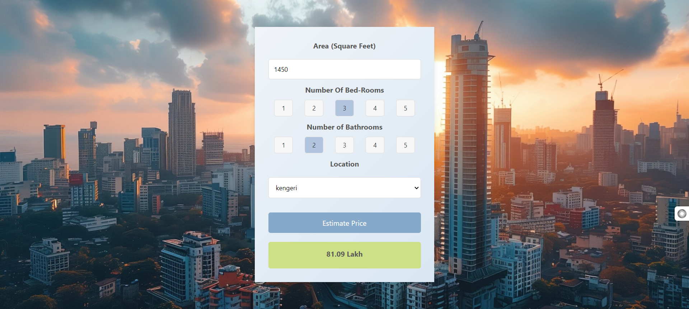

# Bangalore House Price Prediction

[View the deployed website here](http://ec2-16-171-152-102.eu-north-1.compute.amazonaws.com/) 

 

## Project Overview
This project leverages machine learning to predict house prices in Bangalore. Using a dataset of 13,000 entries, we conducted data cleaning, feature engineering, and applied various machine learning algorithms with hyperparameter tuning. The final model was deployed on an AWS EC2 instance, with a web application interface built using Flask.

## Table of Contents
1. [Machine Learning Pipeline](#machine-learning-pipeline)
2. [Data Preparation](#data-preparation)
3. [Feature Engineering](#feature-engineering)
4. [Model Deployment](#model-deployment)
5. [Technologies Used](#technologies-used)
6. [Machine Learning Concepts](#machine-learning-concepts)
7. [References](#references)

## Machine Learning Pipeline
This project involves a complete machine learning pipeline, from data preprocessing to model selection and deployment:
- **Data Preprocessing:** Cleaned data, handled missing values, and transformed categorical variables.
- **Model Training:** Experimented with multiple regressors (Linear Regression, Lasso, Decision Tree) and used hyperparameter tuning to select the best model.
- **Evaluation:** Used cross-validation techniques to validate model performance and identify the most accurate algorithm.
- **Deployment:** Deployed the trained model using Flask on an AWS EC2 instance for real-time predictions.

## Data Preparation
- **Data Cleaning:** 
  - Removed irrelevant columns and handled missing data.
  - Processed `size` data to create a new feature, `BHK`, for model input.
  - Calculated average values for `total_sqft` entries with range values to ensure uniformity.

- **Outlier Detection and Removal:** 
  - Used standard deviation to filter out outliers in the `total_sqft/BHK` ratio.
  - Ensured data consistency by removing entries where smaller units cost more than larger units within the same location.

## Feature Engineering
- Applied **One-Hot Encoding** to convert categorical features into numerical format, enabling the machine learning model to process the data.
- Reduced dimensionality by grouping less frequent locations to avoid the curse of dimensionality, ensuring model efficiency and accuracy.
- Applied techniques to remove the dummy variable trap by excluding one dummy variable column.

## Model Deployment
- **Pickle:** Serialized the trained model for deployment.
- **Flask:** Built a web application with a user-friendly interface to predict house prices based on area, number of bedrooms, bathrooms, and location.
- **AWS EC2 & Nginx:** Set up a scalable AWS EC2 instance with Nginx as a web server to host the Flask application.
- **GitBash & WinSCP:** Utilized GitBash for command-line operations and WinSCP for secure file transfer during deployment.

## Technologies Used
- **Python**: Data preprocessing, feature engineering, and machine learning
- **Flask**: Web framework for model deployment
- **AWS EC2 & Nginx**: Cloud server and web server for scalable deployment
- **WinSCP & GitBash**: Server and file management during deployment

## Machine Learning Concepts
1. **Cross-Validation:** Splits the dataset into multiple folds to evaluate the model's performance on different data splits, providing a robust estimate of accuracy.
2. **Dimensionality Reduction:** Reduces the feature space to avoid overfitting and computational inefficiencies, especially when using one-hot encoding.
3. **Outlier Detection:** Identifies and removes outliers, which can distort model training and reduce accuracy. Standard deviation is used as a method for outlier detection.
4. **One-Hot Encoding:** A technique to convert categorical variables into a format that can be provided to ML algorithms, creating binary columns for each category.
5. **GridSearchCV:** Searches across a range of hyperparameters to find the optimal settings for the model, enhancing accuracy and performance.
6. **Linear Regression, Lasso, and Decision Tree Regressors:** Various algorithms to compare predictive capabilities and choose the best model for deployment.

## References
- [AWS EC2 Documentation](https://aws.amazon.com/ec2/)
- [Nginx Documentation](https://nginx.org/)
- [Flask Documentation](https://flask.palletsprojects.com/)
- [Scikit-Learn Documentation](https://scikit-learn.org/)

